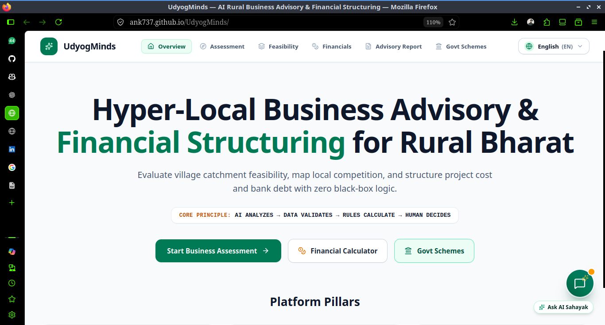
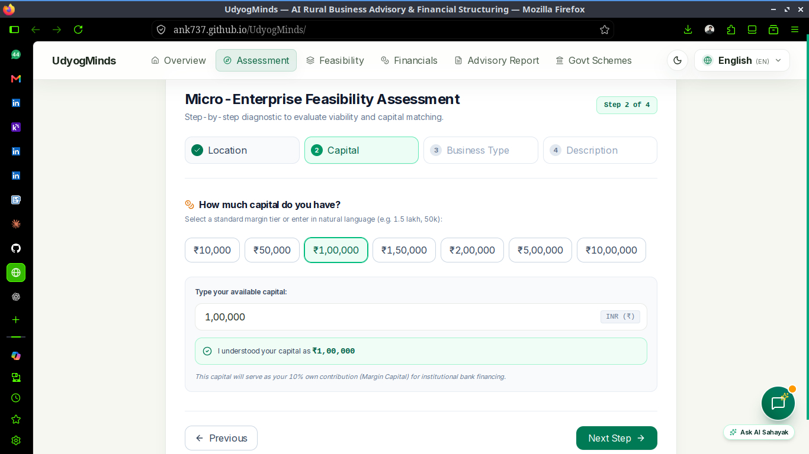
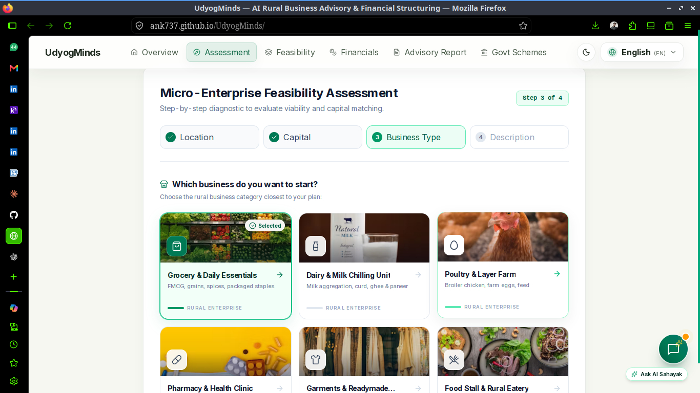
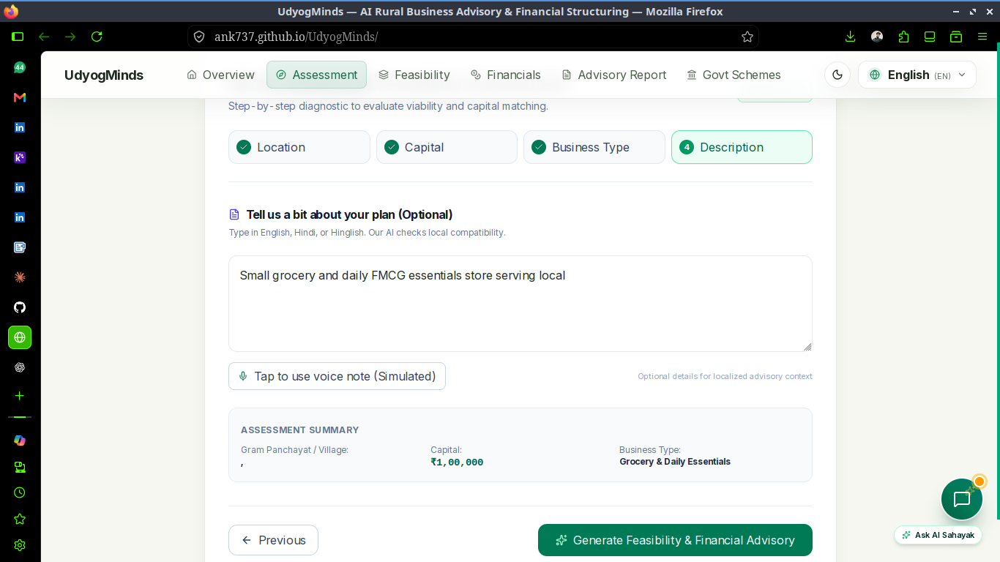
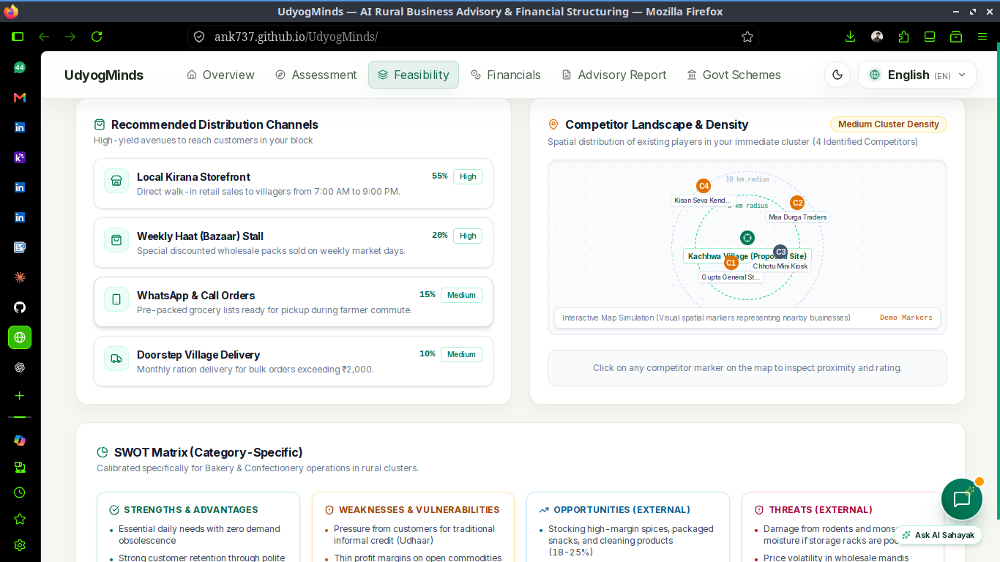
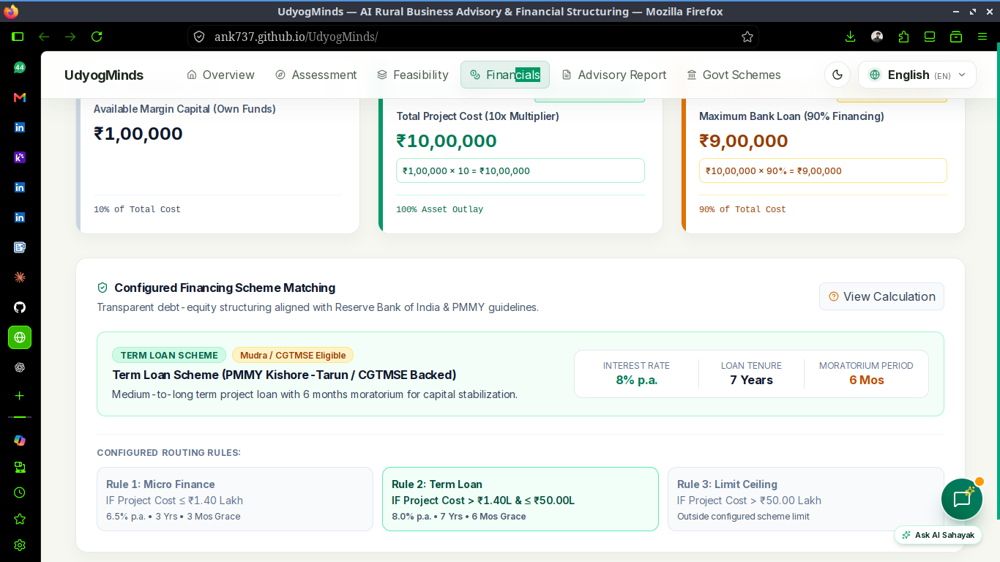
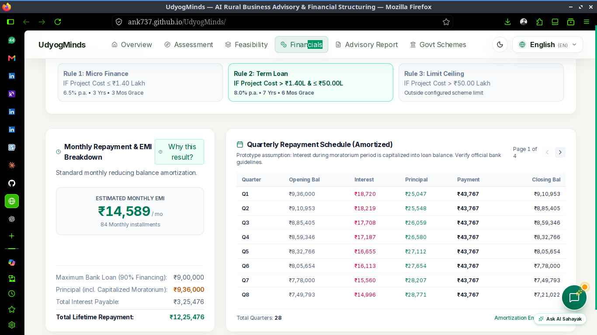
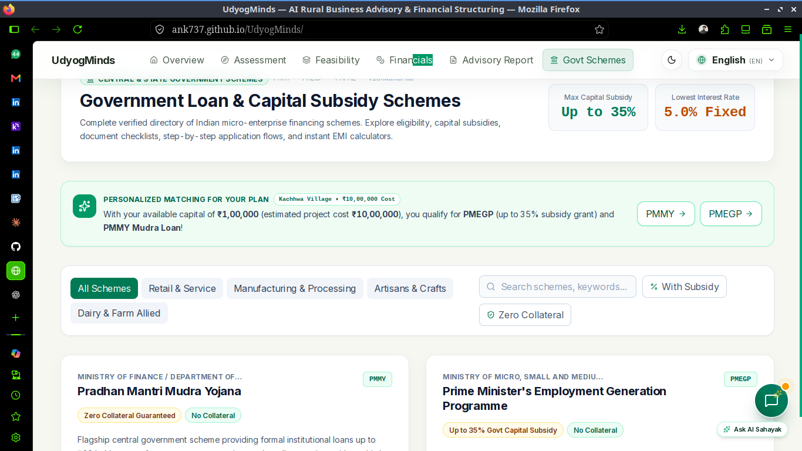

# UdyogMinds — AI-Driven Hyper-Local Business & Financial Advisory

UdyogMinds is an AI-powered business advisory and financial structuring platform designed to help **rural micro-entrepreneurs make informed business decisions**.

The platform combines hyper-local market intelligence, business cost and profitability analysis, financial planning, financing guidance, loan-repayment analysis, and government scheme discovery into a single workflow.

Instead of requiring a first-time entrepreneur to independently research markets, estimate costs, calculate profitability, explore financing options, and search through government schemes, UdyogMinds brings these decision-making steps together in one platform.

---

## 🚀 Problem Statement

Rural micro-entrepreneurs often have the motivation to start or expand a business but face several challenges before making an investment decision.

They may struggle to determine:

* Which business is suitable for their local market?
* What will the initial investment be?
* What will the expected operating cost be?
* How much revenue and profit can the business potentially generate?
* How much financing may be required?
* Can the expected cash flow support loan repayment?
* Which government schemes or financial support programs may be relevant?
* How should the available capital be structured?

These decisions often require information from multiple sources and financial calculations that may be difficult for first-time entrepreneurs.

**UdyogMinds aims to simplify this process through an AI-assisted, structured business advisory workflow.**

---

# 💡 Proposed Solution

UdyogMinds acts as a digital business advisor for rural micro-entrepreneurs.

The platform takes information about the entrepreneur, location, business idea, available capital, expected expenses, and financing requirements and transforms it into a structured business analysis.

### Core workflow

```text
Entrepreneur & Location
          ↓
Business / Market Information
          ↓
Hyper-Local Market Analysis
          ↓
Cost & Revenue Estimation
          ↓
Profitability Analysis
          ↓
Financial Structuring
          ↓
Financing & Loan Analysis
          ↓
Government Scheme Discovery
          ↓
AI-Assisted Business Advisory
```

---

# ✨ Key Features

## 📍 Hyper-Local Business Advisory

UdyogMinds focuses on the local context rather than treating every business opportunity as identical.

The platform considers location-specific information to help entrepreneurs evaluate potential business opportunities according to their local environment.

The objective is to answer:

> **"What kind of business opportunity makes sense for this location and situation?"**

---

## 🏪 Business Opportunity Analysis

Users can provide information about the business they are considering.

The platform can then help structure the business decision around factors such as:

* Business type
* Location
* Initial investment
* Operating expenses
* Expected revenue
* Available capital
* Financing requirement
* Expected profitability

This converts a general business idea into a more structured financial plan.

---

# 💰 Cost & Investment Analysis

Starting a business requires more than estimating the initial purchase cost.

UdyogMinds separates different financial components to provide a clearer view of the required investment.

Examples include:

```text
Initial Investment
        +
Equipment / Infrastructure
        +
Operating Expenses
        +
Working Capital
        +
Other Business Costs
        ↓
Total Capital Requirement
```

This helps entrepreneurs understand how much capital may actually be required to start and operate the proposed business.

---

# 📊 Revenue & Profitability Analysis

UdyogMinds helps estimate the financial performance of a proposed business using the provided assumptions.

The analysis can include:

* Expected revenue
* Operating expenses
* Gross/estimated profit
* Profit margin
* Break-even considerations
* Monthly financial requirements

A simplified representation:

```text
Revenue
   -
Operating Costs
   =
Estimated Profit
```

The platform is intended to help users understand the financial implications of their assumptions before making an investment decision.

---

# 🧮 Financial Structuring

One of the core objectives of UdyogMinds is to help entrepreneurs understand **how the required business capital can be structured**.

For example:

```text
Total Project Cost
        │
        ├── Own Contribution
        │
        ├── Loan / Financing
        │
        └── Other Eligible Support
```

This provides a clearer picture of:

* Total project cost
* Available personal capital
* Funding gap
* Potential financing requirement
* Overall financial structure

---

# 🏦 Financing & Loan Analysis

For entrepreneurs who require external financing, UdyogMinds can help analyze the financial implications of borrowing.

The platform can consider factors such as:

* Loan amount
* Interest rate
* Loan tenure
* Estimated EMI
* Repayment requirement
* Expected business cash flow

Example:

```text
Required Financing
        ↓
Loan Parameters
        ↓
Estimated EMI
        ↓
Business Cash Flow
        ↓
Repayment Analysis
```

This allows the entrepreneur to understand whether the proposed financing structure is compatible with the expected business economics.

> Financial calculations and recommendations are intended for planning and decision support. Actual loan eligibility, interest rates, terms, and approvals depend on the relevant financial institution and applicable rules.

---

# 🏛️ Government Scheme Discovery

Finding relevant government schemes can be difficult because information is distributed across different government portals and programs.

UdyogMinds aims to simplify this process by helping users identify government schemes that may be relevant to their business requirements.

The system can consider factors such as:

* Business category
* Project cost
* Entrepreneur profile
* Financing requirement
* Location
* Business activity
* Eligibility-related information

The goal is not simply to display a long list of schemes, but to help users identify **potentially relevant schemes based on their business situation**.

> Scheme availability, eligibility, benefits, and application requirements should always be verified against the relevant official government source before making a financial decision.

---

# 🤖 AI-Assisted Business Advisory

UdyogMinds combines structured calculations and AI-assisted reasoning to make the resulting information easier to understand.

The AI layer can help transform structured business and financial information into practical explanations such as:

* Business insights
* Financial observations
* Potential risks
* Cost considerations
* Funding considerations
* Business planning suggestions
* Scheme-related guidance

The purpose of the AI layer is to make complex financial and business information more understandable for users who may not have a technical or financial background.

---

# 📈 Business Feasibility Analysis

UdyogMinds brings the different components together to provide a broader view of a proposed business.

```text
             Business Idea
                   │
                   ▼
          Market Conditions
                   │
                   ▼
           Cost Estimation
                   │
                   ▼
          Revenue Estimation
                   │
                   ▼
         Profitability Analysis
                   │
                   ▼
         Financial Structuring
                   │
                   ▼
       Financing / Loan Analysis
                   │
                   ▼
        Scheme Identification
                   │
                   ▼
          Business Advisory
```

This gives entrepreneurs a structured way to evaluate their idea before committing capital.

---

# 🌐 User Experience

The platform is designed around a simple question-and-analysis workflow rather than requiring users to understand financial terminology or complex spreadsheets.

A typical user journey is:

```text
1. Enter business requirements
             ↓
2. Provide location information
             ↓
3. Enter available capital
             ↓
4. Enter project/business requirements
             ↓
5. Analyze costs and profitability
             ↓
6. Review financial structure
             ↓
7. Explore financing requirements
             ↓
8. Identify potentially relevant schemes
             ↓
9. Review AI-generated business insights
```

---

# 🏗️ System Architecture

UdyogMinds follows a modular architecture combining the user interface, business logic, financial calculations, AI capabilities, and external information sources.

```text
                       ┌──────────────────────┐
                       │        User          │
                       │ Rural Entrepreneur   │
                       └──────────┬───────────┘
                                  │
                                  ▼
                       ┌──────────────────────┐
                       │    Web Interface     │
                       │                      │
                       │ Business Input       │
                       │ Financial Input      │
                       │ Location             │
                       │ Analysis Dashboard   │
                       └──────────┬───────────┘
                                  │
                                  ▼
                       ┌──────────────────────┐
                       │  Application Logic   │
                       │                      │
                       │ Business Analysis    │
                       │ Cost Analysis        │
                       │ Profitability        │
                       │ Financial Structure  │
                       │ Loan Analysis        │
                       └───────┬───────┬──────┘
                               │       │
                    ┌──────────┘       └───────────┐
                    ▼                              ▼
          ┌──────────────────┐            ┌──────────────────┐
          │   AI / ML Layer  │            │ External Sources │
          │                  │            │                  │
          │ Business Insights│            │ Market Data      │
          │ Advisory         │            │ Govt. Schemes    │
          └──────────────────┘            └──────────────────┘
```

---

# 🛠️ Technology Stack

## Frontend

* HTML5
* CSS3
* JavaScript
* Responsive web interface

## AI / Machine Learning

* Python
* Machine Learning
* Data preprocessing
* Feature engineering
* Model-based analysis
* AI-assisted business advisory

## Data & Analytics

* Python
* NumPy
* Pandas
* Matplotlib
* Statistical analysis
* Financial calculations

## Backend / Integration

Depending on the deployed version of the application:

* REST APIs
* Python backend
* API integration
* Data processing services

## Development Tools

* Git
* GitHub
* VS Code
* Jupyter Notebook
* Linux

---

# 🧠 AI/ML Approach

UdyogMinds is designed around the idea that business advisory should combine **data-driven analysis with contextual information**.

The general analytical pipeline is:

```text
Raw User Input
      ↓
Data Preprocessing
      ↓
Feature Engineering
      ↓
Business / Financial Analysis
      ↓
Model / AI Processing
      ↓
Result Generation
      ↓
Human-Readable Advisory
```

The system can use structured business variables to derive useful financial and business indicators before presenting the results to the user.

---

# 📊 Financial Analysis Pipeline

The financial analysis can be represented as:

```text
Project Cost
     │
     ├──────────────► Own Capital
     │
     └──────────────► Funding Requirement
                              │
                              ▼
                         Loan Analysis
                              │
                              ▼
                       Repayment Estimate
                              │
                              ▼
                    Business Cash Flow
                              │
                              ▼
                    Financial Assessment
```

This provides a structured relationship between project cost, financing requirements, and repayment considerations.

---

# 🔎 Government Scheme Matching

A major part of the platform is the idea of moving beyond generic scheme listings.

The intended workflow is:

```text
Entrepreneur Profile
        +
Business Type
        +
Project Cost
        +
Location
        +
Funding Requirement
        ↓
Eligibility / Relevance Analysis
        ↓
Potentially Relevant Schemes
        ↓
Scheme Details
        ↓
Official Source Verification
```

This can make scheme discovery more useful than manually searching through large numbers of government programs.

---

# 📱 Example Use Case

Consider a rural entrepreneur who wants to start a small business but has limited personal capital.

The entrepreneur could provide:

```text
Location:
Rural area

Business:
Small-scale enterprise

Available Capital:
₹2,00,000

Estimated Project Cost:
₹5,00,000
```

UdyogMinds can then structure the analysis around:

```text
Project Cost
     ↓
Available Own Capital
     ↓
Funding Gap
     ↓
Potential Financing Requirement
     ↓
Estimated Repayment
     ↓
Business Profitability
     ↓
Potentially Relevant Government Schemes
```

Instead of receiving isolated calculations, the user gets a connected view of the business decision.

---

# 📸 Screenshots

## 🏠 Home Page



## 📋 Business Input







## 📊 Business Analysis Dashboard



## 💰 Financial Analysis



## 🏦 Financing & Loan Analysis



## 🏛️ Government Scheme Recommendations



---

# 🎯 Why I Built UdyogMinds

UdyogMinds was developed around a practical problem faced by rural micro-entrepreneurs: **making a business decision requires understanding multiple interconnected factors at the same time.**

A business idea may look profitable initially, but the actual decision can depend on:

* Local demand
* Initial investment
* Operating costs
* Available capital
* Financing requirements
* Loan repayment capacity
* Government support
* Expected profitability

UdyogMinds attempts to bring these factors together into one structured decision-support platform.

---

# 🏆 Smart India Hackathon 2026

UdyogMinds was developed for **Smart India Hackathon 2026**.

### Problem Statement

**Problem Statement ID:** `26091`

### Problem

**AI-Driven Hyper-Local Business Advisory and Financial Structuring Assistant for Rural Micro-Entrepreneurs**

### Project Focus

The project focuses on using AI, data analysis, and financial modelling to assist rural micro-entrepreneurs with:

* Hyper-local business intelligence
* Business selection
* Cost and profitability analysis
* Financial structuring
* Financing guidance
* Loan-repayment analysis
* Government scheme discovery

### Team Achievement

The project was selected among the **Top 10 projects at the college-level round**.

---

# 👨‍💻 My Contribution

My primary contributions to UdyogMinds included:

### Project Planning

* Helped structure the overall solution
* Broke the problem into technical and analytical components
* Contributed to the product workflow

### Research & Data Analysis

* Researched the problem domain
* Analyzed business and financial requirements
* Worked on structuring the data required for business analysis

### AI/ML Development

* Worked on the AI/ML components
* Contributed to data processing and analytical logic
* Worked on integrating the analysis into the overall application

The project gave me practical experience in taking an AI/ML-oriented problem from **problem research and analysis through implementation and deployment**.

---

# 🔄 End-to-End Solution

UdyogMinds brings the entire process into one workflow:

```text
                 USER
                  │
                  ▼
        Business Requirements
                  │
                  ▼
          Hyper-Local Context
                  │
                  ▼
          Business Analysis
                  │
          ┌───────┴────────┐
          ▼                ▼
   Cost Analysis      Revenue Analysis
          │                │
          └───────┬────────┘
                  ▼
           Profitability
                  │
                  ▼
        Financial Structuring
                  │
                  ▼
        Financing Requirement
                  │
                  ▼
         Loan Repayment
                  │
                  ▼
      Government Scheme Search
                  │
                  ▼
          AI Business Advice
                  │
                  ▼
             USER
```

---

# 📌 Key Project Highlights

* AI-driven rural business advisory platform
* Designed specifically for micro-entrepreneurs
* Hyper-local business decision support
* Business cost and profitability analysis
* Financial structuring
* Financing requirement analysis
* Loan repayment analysis
* Government scheme discovery
* AI-assisted business recommendations
* Data-driven decision support
* Developed for Smart India Hackathon 2026
* Selected among Top 10 projects at college level

---

# 🔮 Future Improvements

Potential future improvements include:

* Integration with more reliable real-time local market datasets
* Automated collection of verified government scheme information
* More advanced scheme eligibility matching
* Improved business recommendation models
* Regional/language support for rural users
* Voice-based interaction
* More detailed cash-flow forecasting
* Sensitivity and scenario analysis
* Business risk scoring
* Integration with additional financial data sources
* More comprehensive loan and repayment simulations
* Mobile-first interface
* Deployment of more advanced ML models as sufficient real-world data becomes available

---

# ⚠️ Disclaimer

UdyogMinds is a **decision-support and educational project**.

Business profitability, market conditions, loan eligibility, interest rates, government scheme eligibility, and financial outcomes can vary based on real-world circumstances.

The information generated by the platform should not be treated as a guarantee of business success, loan approval, subsidy approval, or financial return.

Users should verify important financial and scheme-related information through the relevant official sources and qualified professionals before making financial decisions.

---

# 📌 Project Status

**Active Development**

UdyogMinds is being developed as an AI-driven business and financial decision-support platform for rural micro-entrepreneurs.

---

# 👨‍💻 Author

**Ankush**

B.Tech Information Technology Student
AI/ML Enthusiast

GitHub: `ank737`

---

## ⭐ Project

If you find UdyogMinds interesting, feel free to explore the repository and share feedback or suggestions.
